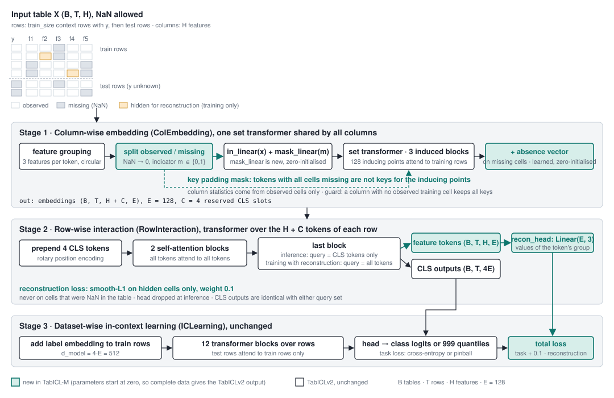
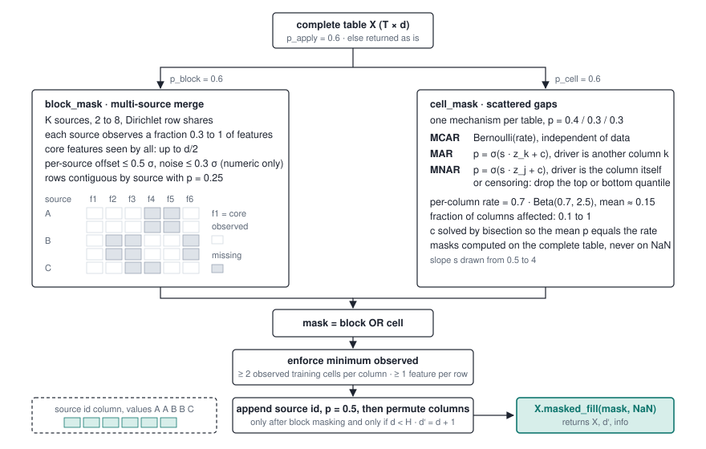
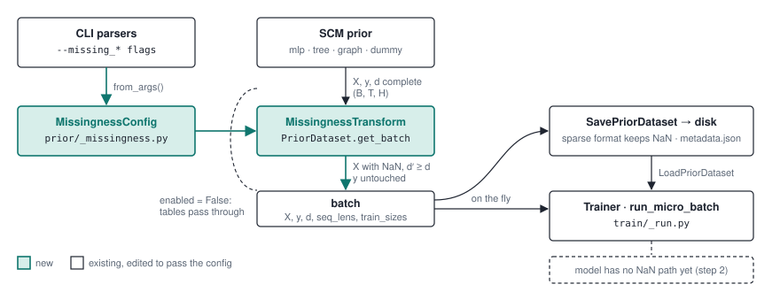

# TabICL-M: a tabular foundation model for incomplete tables

TabICL-M (M for missingness) extends [TabICLv2](https://github.com/soda-inria/tabicl)
so that it learns from tables in which not every row has every feature. It targets
the case that is common in engineering databases: the table is a merge of several
sources, and each source measured its own subset of the features. That is
block-structured missingness, not random gaps.

This repository is a fork of TabICL by Qu, Holzmüller, Varoquaux and Le Morvan.
All of TabICLv2 is still here and works unchanged. TabICL-M adds three parts on top,
each behind a flag, so each can be switched off for ablation.

**Status.** Research code. The three parts are implemented and tested, and the
first stage-4 run is done: the classifier and the regressor were each trained for
3000 steps from the released TabICLv2 weights on one GPU. The checkpoints are in
this repository under `checkpoints/tabicl-m/<task>/step-3000.ckpt` (git LFS, run
`git lfs pull`). On complete data they reproduce TabICLv2 exactly. Under injected
missingness they tie the mean-imputation baseline within seed noise, and both beat
XGBoost and CatBoost. See [Results so far](#results-so-far) and
[What remains](#what-remains).

**Workflow in three commands.** Install, run continued pre-training on one GPU,
evaluate against the baselines:

```bash
pip install -e ".[pretrain]"
bash scripts/train_v2_missing_stage4.sh clf          # and: reg
python scripts/ablation_missingness.py --out results/ablation \
    --aware_ckpt checkpoints/tabicl-m/clf/step-3000.ckpt --plot
```

## What is new



*The three stages of TabICLv2 with the TabICL-M additions in green. The full
description of the architecture, the training objective, and every revised file
with its size is in [docs/tabicl_m_architecture.md](./docs/tabicl_m_architecture.md).*



*How the prior turns a complete synthetic table into an incomplete one: block
masking by source on the left, cell-wise masking on the right, then the union,
the safety rules, and the optional source-id column.*

**1. A block-structured missingness prior.** The synthetic tables used for
pre-training are split into 2 to 8 sources. Each source observes its own subset of
features, with an optional core set seen by all. Sources can carry an additive
offset and extra noise on numeric features, and the source id can be appended as a
categorical column. Cell-wise gaps under MCAR, MAR, and MNAR mechanisms, including
detection-limit censoring, are layered on top. Every mechanism hits a sampled target
rate. The target is never masked. Code: `src/tabicl/prior/_missingness.py`.

**2. An observed-only column embedding with a learned absence vector.** TabICL
embeds each column with a set transformer over its rows. In TabICL-M, missing
cells are hidden from the keys of the inducing-point attention, so the column
statistics come from observed cells only. A missing indicator is projected into the
input token and a learned absence vector is added to the output embedding. Both new
parameters start at zero, so on complete data the model reproduces TabICLv2
exactly. Flag: `col_missing_aware`. Code: `src/tabicl/_model/embedding.py`.

**3. A joint prediction and reconstruction objective.** During pre-training a
fraction of the observed cells is hidden. The model predicts the target as usual and
reconstructs the hidden cells from the per-feature outputs of the row-wise
interaction through a small head. The head is dropped at inference. Flag:
`reconstruction`, trainer option `--recon_weight`. Code:
`src/tabicl/train/_reconstruction.py`.

### What is not new

Three ideas close to this work are published and are not claimed here.
[TabPFN v2](https://www.nature.com/articles/s41586-024-08328-6) injects cell-wise
missingness into its prior and adds a missing indicator to its encoder.
[NAIM](https://arxiv.org/abs/2407.11540) masks missing features out of attention
instead of imputing. [ReMasker](https://arxiv.org/abs/2309.13793) and
[VIME](https://arxiv.org/abs/2006.06731) train tabular models with masked-cell
reconstruction. All three treat missingness as cell-wise and random. None is an
in-context learner. The contribution of TabICL-M is the source-structured prior,
the column-level masking inside an inducing-point set transformer, and the joint
objective inside a tabular in-context learner.

## Installation

```bash
git clone https://github.com/Sompote/tabicl-m.git && cd tabicl-m
pip install -e .
```

The distribution is named `tabicl-m`, so it does not collide with the upstream
`tabicl` package on PyPI. The import name stays `tabicl`, so upstream code, the
released checkpoints, and the tutorials work unchanged. Do not install both in the
same environment.

Optional dependencies:

```bash
pip install -e ".[pretrain]"   # continued pre-training (wandb, transformers, xgboost)
pip install -e ".[finetune]"   # fine-tuning on a single dataset
pip install -e ".[forecast]"   # time series forecasting
pip install -e ".[shap]"       # SHAP explanations
pip install -e ".[all]"
```

## Basic usage

The estimators are scikit-learn compatible. With the released TabICLv2 checkpoint,
missing numeric values are mean-imputed and missing categories get their own code,
exactly as in upstream TabICL.

```python
from tabicl import TabICLClassifier, TabICLRegressor

clf = TabICLClassifier()          # downloads the TabICLv2 checkpoint on first use
clf.fit(X_train, y_train)
clf.predict(X_test)               # in-context learning happens here

reg = TabICLRegressor()
reg.fit(X_train, y_train)
reg.predict(X_test)
```

With a checkpoint trained with `col_missing_aware=True`, the same estimators pass
NaN straight through to the model. No imputation is applied, in numeric or
categorical columns. Nothing changes in the calling code:

```python
clf = TabICLClassifier(model_path="checkpoints/tabicl-m/clf/step-3000.ckpt")
clf.fit(X_train, y_train)         # X_train may contain NaN in any column
clf.predict(X_test)
print(clf.X_encoder_.impute)      # False: the model saw the gaps
```

KV caching, save and load, the full parameter list, fine-tuning, forecasting, and
SHAP work as in upstream TabICL. See [Inherited features](#inherited-features).

## Missing values: how each path treats them

| Path | Numeric NaN | Categorical NaN | Column statistics | Seen in pre-training |
|---|---|---|---|---|
| TabICLv2, released | mean-imputed | own category | include imputed values | no |
| TabICLv2 + indicator columns | mean-imputed | own category | include imputed values | no |
| TabICL-M, `col_missing_aware` | kept as NaN | kept as NaN | observed cells only | yes |

## Continued pre-training (stage 4)

TabICL-M is trained by continuing from the released TabICLv2 weights with the
three parts switched on. The new parameters are zero at step 0, so the run starts
exactly at the released model on complete data. One GPU with 32 GB is enough for
the default settings with `DTYPE=bfloat16`; in float32 the attention falls back to
memory-hungry kernels when FlashAttention-3 is not available and runs out of memory
at `--max_seq_len 8192`.

```bash
pip install -e ".[pretrain]"
python -c "from tabicl import TabICLClassifier, TabICLRegressor; TabICLClassifier()._load_model(); TabICLRegressor()._load_model()"
bash scripts/train_v2_missing_stage4.sh clf
bash scripts/train_v2_missing_stage4.sh reg
```

The script copies the stage-3 recipe of TabICLv2 and adds:

```
--missing_enabled True        # block-structured and cell-wise missingness in the prior
--col_missing_aware True      # observed-only column embedding with absence vector
--recon_weight 0.1            # masked-cell reconstruction, hide up to 30 % of observed cells
--checkpoint_path <released>  --only_load_model True
```

Environment variables override the defaults, for example `STEPS=6000 BATCH=64
NUM_GPUS=4 RECON_WEIGHT=0.05 DTYPE=bfloat16 RECOMPUTE=True`. The trainer logs the task loss and the
reconstruction loss separately. The task loss should stay near its starting value.
The reconstruction loss should fall. Checkpoints are written to
`checkpoints/tabicl-m/<task>/step-*.ckpt` and load directly into the estimators.

The run that produced the committed checkpoints (`checkpoints/tabicl-m/run_stage4.sh`,
one RTX 5090, bfloat16, 3000 steps, batch 32, `--max_seq_len 8192`, 2 h 20 min per
task) behaved as intended. Averaged over 250-step windows:

| Task | Task loss, steps 0 to 249 | Task loss, steps 2750 to 2999 | Reconstruction, first window | Reconstruction, last window |
|---|---|---|---|---|
| classifier | cross-entropy 0.82 (accuracy 0.73) | 0.55 (0.78) | 0.24 | 0.19 |
| regressor | pinball 0.084 | 0.080 | 0.24 | 0.20 |

The classifier's task loss falls at first because the released model has never seen
tables with gaps; the regressor's stays flat. The reconstruction loss falls in both.

All `--missing_*` options are listed by `python -m tabicl.train --help`. The
same options apply to `python -m tabicl.prior` when tables are pre-generated to
disk, and the missingness configuration is written to the dataset `metadata.json`.



*The missingness transform runs on every batch right after the structural causal
model prior, whether tables are generated on the fly or written to disk. It is a
bypass unless `--missing_enabled True` is passed.*

## Evaluation

`scripts/ablation_missingness.py` deletes cells from complete tables under a
stated mechanism at a stated rate and compares:

| Model name | What it is |
|---|---|
| `tabicl_impute` | released TabICLv2, NaN mean-imputed (the baseline) |
| `tabicl_indicator` | as above, plus one 0/1 indicator column per incomplete feature |
| `tabicl_aware_zero` | released weights inside the TabICL-M architecture, new parameters at zero |
| `tabicl_aware` | a TabICL-M checkpoint from stage 4 |
| `xgboost`, `catboost`, `tabpfn` | baselines with native NaN handling |

Mechanisms are `mcar`, `mar`, `mnar`, and `block`. Metrics are AUC, accuracy, and
log loss for classification, and RMSE, R², and the coverage and width of the
80 % prediction interval for regression. A CSV with a source column runs
leave-one-source-out splits on its natural gaps.

```bash
# synthetic ablation
python scripts/ablation_missingness.py --out results/ablation \
    --datasets diabetes openml:1590 --aware_ckpt checkpoints/tabicl-m/clf/step-3000.ckpt \
    --aware_ckpt_reg checkpoints/tabicl-m/reg/step-3000.ckpt --plot

# real multi-source table, leave-one-source-out, natural missingness
python scripts/ablation_missingness.py --out results/loso \
    --datasets csv:data/compaction.csv --target rho_d_max --source_col lab \
    --task regression --loso --natural --aware_ckpt_reg checkpoints/tabicl-m/reg/step-3000.ckpt
```

Outputs are `results.csv` with one row per fit, `summary.csv` and `summary.md`
with mean and spread over seeds, and plots. `--resummarize` rebuilds the tables
from a saved results file.

### Results so far

**Before training** (`results/ablation_v2/`), the released TabICLv2 weights inside
the three TabICL paths did not differ, as expected with the new parameters at zero.
That established that the architecture change does not hurt and that the baseline
is strong: mean imputation inside an in-context learner already absorbs most of the
damage.

**After stage 4** (`results/ablation_m/`, `results/ablation_m/run.sh`): six
datasets, four mechanisms, three rates, three seeds, six models, 1404 fits. The
three built-in datasets are those of the first evaluation. The three OpenML
datasets were added because the built-in classification sets sit at AUC 0.98 to
1.00 and cannot separate the models: `credit-g` (31), `adult` (1590, subsampled to
3000 rows), and Boston housing (531). `tabicl_aware` is the committed step-3000
checkpoint. Mean over seeds at the highest deletion rate:

`adult`, AUC (2100 training rows, 14 features):

| Mechanism | Rate | `tabicl_impute` | `tabicl_indicator` | `tabicl_aware_zero` | `tabicl_aware` | `xgboost` | `catboost` |
|---|---|---|---|---|---|---|---|
| complete | 0.0 | 0.912 | 0.911 | 0.912 | 0.912 | 0.897 | 0.896 |
| mcar | 0.5 | 0.858 | 0.856 | 0.857 | 0.857 | 0.841 | 0.836 |
| mar | 0.5 | 0.850 | 0.848 | 0.849 | 0.849 | 0.837 | 0.839 |
| mnar | 0.5 | 0.859 | 0.855 | 0.858 | 0.859 | 0.838 | 0.839 |
| block | 0.5 | 0.860 | 0.856 | 0.862 | 0.865 | 0.849 | 0.855 |

`credit-g`, AUC (700 training rows, 20 features):

| Mechanism | Rate | `tabicl_impute` | `tabicl_indicator` | `tabicl_aware_zero` | `tabicl_aware` | `xgboost` | `catboost` |
|---|---|---|---|---|---|---|---|
| complete | 0.0 | 0.828 | 0.828 | 0.828 | 0.828 | 0.801 | 0.807 |
| mcar | 0.5 | 0.696 | 0.689 | 0.696 | 0.701 | 0.674 | 0.664 |
| mar | 0.5 | 0.725 | 0.721 | 0.727 | 0.724 | 0.679 | 0.664 |
| mnar | 0.5 | 0.760 | 0.758 | 0.758 | 0.759 | 0.728 | 0.707 |
| block | 0.5 | 0.729 | 0.729 | 0.728 | 0.729 | 0.691 | 0.692 |

Boston housing, RMSE (354 training rows, 13 features):

| Mechanism | Rate | `tabicl_impute` | `tabicl_indicator` | `tabicl_aware_zero` | `tabicl_aware` | `xgboost` | `catboost` |
|---|---|---|---|---|---|---|---|
| complete | 0.0 | 3.01 | 3.01 | 3.01 | 3.02 | 3.34 | 2.99 |
| mcar | 0.5 | 5.90 | 5.88 | 5.83 | 5.68 | 6.04 | 6.17 |
| mar | 0.5 | 4.97 | 5.09 | 5.11 | 4.89 | 5.71 | 5.39 |
| mnar | 0.5 | 5.08 | 5.09 | 5.04 | 4.98 | 5.09 | 5.16 |
| block | 0.5 | 4.79 | 4.80 | 4.80 | 4.80 | 4.89 | 4.67 |

Diabetes, RMSE:

| Mechanism | Rate | `tabicl_impute` | `tabicl_indicator` | `tabicl_aware_zero` | `tabicl_aware` | `xgboost` | `catboost` |
|---|---|---|---|---|---|---|---|
| complete | 0.0 | 56.6 | 56.6 | 56.6 | 56.7 | 62.1 | 59.7 |
| mcar | 0.5 | 65.6 | 65.5 | 65.5 | 65.1 | 69.9 | 69.8 |
| mar | 0.5 | 61.5 | 61.9 | 62.7 | 61.6 | 67.4 | 63.4 |
| mnar | 0.5 | 62.7 | 62.2 | 63.4 | 62.6 | 71.0 | 67.6 |
| block | 0.5 | 63.6 | 63.6 | 63.4 | 63.2 | 69.7 | 66.1 |

Paired over all 39 conditions per dataset (same seed, same deleted cells):

| Dataset | Metric | wins / losses vs `tabicl_impute` | mean gain (higher AUC, lower RMSE) | wins / losses vs `xgboost` | mean gain |
|---|---|---|---|---|---|
| breast_cancer | AUC | 28 / 10 | +0.0004 AUC | 29 / 9 | +0.003 AUC |
| wine | AUC | 12 / 8 | +0.0004 AUC | 30 / 2 | +0.010 AUC |
| credit-g | AUC | 21 / 18 | +0.0003 AUC | 35 / 4 | +0.034 AUC |
| adult | AUC | 15 / 24 | -0.0006 AUC | 38 / 1 | +0.016 AUC |
| diabetes | RMSE | 28 / 11 | +0.21 RMSE | 39 / 0 | +5.70 RMSE |
| Boston | RMSE | 25 / 14 | +0.07 RMSE | 30 / 9 | +0.31 RMSE |

Three things follow.

1. **Training did not hurt.** On complete data the trained model matches the
   released model within 0.001 AUC and 0.01 RMSE on every dataset.
2. **TabICL-M ties mean imputation.** It wins about 60 % of the paired comparisons
   against `tabicl_impute`, but the mean gain is inside the seed spread everywhere.
   The only consistent edge is regression under MAR and MCAR on Boston housing
   (RMSE 4.89 against 4.97 and 5.68 against 5.90 at rate 0.5). The trained
   parameters do something, since `tabicl_aware` also edges out `tabicl_aware_zero`,
   but not much on these tables. This is the fallback outcome stated below:
   TabICLv2 with mean imputation is already robust to random gaps.
3. **Both TabICL paths beat the tree baselines with native NaN handling** on five
   of the six datasets, by 0.016 AUC on `adult`, 0.034 to 0.038 AUC on `credit-g`
   (39 wins, 0 losses against CatBoost on both), and 3.6 to 5.7 RMSE on diabetes.
   The exception is Boston housing under block missingness, where CatBoost is
   slightly ahead.

The block mechanism here removes column blocks per source but injects no per-source
offset or noise, and the split is random, not by source. That is the mild version of
the case TabICL-M is built for. Full tables and plots:
`results/ablation_m/builtin/summary.md`, `results/ablation_m/openml/summary.md`.

## What remains

1. **Block missingness with source shift.** Rerun the evaluation with per-source
   offset and noise injected in the block mechanism, and with splits by source.
   The random-split block case above does not exercise the source-structured prior.
2. **Leave-one-source-out on real data.** The compaction database with its
   provenance groups is the target case. Random splits overstate the result,
   because the model can learn the source instead of the physics.
3. **Ablate each part.** Each flag can be switched off. A part that adds nothing
   is dropped from the claim.
4. **A longer run.** 3000 steps at learning rate 1e-5 is a short continuation.
   The reconstruction loss was still falling at the end.

If the trained model does not beat mean imputation on the block case with source
shift, the honest result is that TabICLv2 is already robust to missing cells.

## Repository map

```
src/tabicl/prior/_missingness.py      block-structured and cell-wise missingness for prior tables
src/tabicl/_model/embedding.py        missing-aware column embedding (col_missing_aware)
src/tabicl/_model/layers.py           key padding mask through the induced self-attention block
src/tabicl/_model/interaction.py      per-feature token outputs for reconstruction
src/tabicl/_model/tabicl.py           flags, reconstruction head and loss, tolerant checkpoint loading
src/tabicl/train/_reconstruction.py   hide-mask sampling for the reconstruction objective
src/tabicl/train/_run.py              joint loss in the trainer
src/tabicl/_sklearn/                  NaN pass-through when the model is missing-aware
scripts/train_v2_missing_stage4.sh    continued pre-training recipe
scripts/ablation_missingness.py       evaluation runner
checkpoints/tabicl-m/                 stage-4 checkpoints (git LFS) and the launcher that produced them
results/ablation_v2/                  evaluation of the released weights before stage 4
results/ablation_m/                   evaluation of the trained checkpoints, with the runner script
tests/test_prior_missingness.py       tests for each part (62 in total)
tests/test_missing_aware_embedding.py
tests/test_reconstruction_head.py
tests/test_ablation_runner.py
docs/tabicl_m_architecture.md         architecture, objective, and file-by-file revisions
docs/figures/missingness_prior/       diagrams: architecture, prior mechanism, pipeline (PNG and SVG)
```

Run the tests with `pytest tests/`. The four new files need no checkpoint. On
macOS, XGBoost and torch load two different OpenMP runtimes and can deadlock in one
process; the ablation runner fits tree baselines in a spawned child for that reason.

## Inherited features

Everything below comes from upstream TabICLv2 and is unchanged.

**KV cache and persistence.** `TabICLClassifier(kv_cache=True)` caches the
training context during `fit` for fast repeated `predict`. `clf.save(path)` and
`TabICLClassifier.load(path)` persist a fitted estimator, optionally without the
training data when a cache exists.

**Parameters.** `n_estimators=8`, `norm_methods`, `feat_shuffle_method="latin"`,
`class_shuffle_method="shift"`, `outlier_threshold=4.0`,
`softmax_temperature=0.9`, `average_logits=True`, `support_many_classes=True`,
`batch_size=8`, `model_path`, `checkpoint_version`, `device`, `use_amp="auto"`,
`use_fa3="auto"`, `offload_mode="auto"`, `random_state=42`, `n_jobs`,
`inference_config`. See the class docstrings.

**Available upstream checkpoints.** `tabicl-classifier-v2-20260212.ckpt` and
`tabicl-regressor-v2-20260212.ckpt` (default), plus the v1 and v1.1 classifiers.
They download from Hugging Face on first use.

**Fine-tuning.** `FinetunedTabICLClassifier` and `FinetunedTabICLRegressor`
adapt a checkpoint to one dataset with AdamW, early stopping, and multi-GPU under
`torchrun`. See `tutorials/finetune_classifier.py`.

**Time series.** `TabICLForecaster` does zero-shot forecasting through the
regressor. See `tutorials/time_series_forecasting.py`.

**Explainability.** `tabicl.shap` computes SHAP values using an all-NaN background
row. With the released checkpoints the all-NaN columns are handled by the wrapper.

**Pre-training from scratch.** The three-stage TabICLv2 recipes are in
`scripts/train_v2_{clf,reg}_stage{1,2,3}.sh`. Prior tables can be generated on the
fly or written to disk with `python -m tabicl.prior`.

**Preprocessing.** Categorical columns are ordinal-encoded, outliers clipped,
features scaled and normalised, and features shuffled across ensemble members.
For heterogeneous raw data, [skrub](https://skrub-data.org) `TableVectorizer` in a
scikit-learn pipeline works well in front of the estimators.

## Citation

TabICL-M has no paper yet. If you use this code, cite the upstream TabICL papers:

```bibtex
@inproceedings{qu2025tabicl,
  title={Tab{ICL}: {A} Tabular Foundation Model for In-Context Learning on Large Data},
  author={Qu, Jingang and Holzm{\"u}ller, David and Varoquaux, Ga{\"e}l and Le Morvan, Marine},
  booktitle={International Conference on Machine Learning},
  year={2025}
}

@article{qu2026tabiclv2,
  title={{TabICLv2}: {A} better, faster, scalable, and open tabular foundation model},
  author={Qu, Jingang and Holzm{\"u}ller, David and Varoquaux, Ga{\"e}l and Le Morvan, Marine},
  booktitle={International Conference on Machine Learning},
  year={2026}
}
```

## Authors and license

TabICL-M: Sompote Youwai, King Mongkut's University of Technology Thonburi.

Upstream TabICL: Jingang Qu, David Holzmüller, Marine Le Morvan, and Gaël
Varoquaux (Inria Soda). Both are released under the BSD 3-Clause License, see
`LICENSE`.
