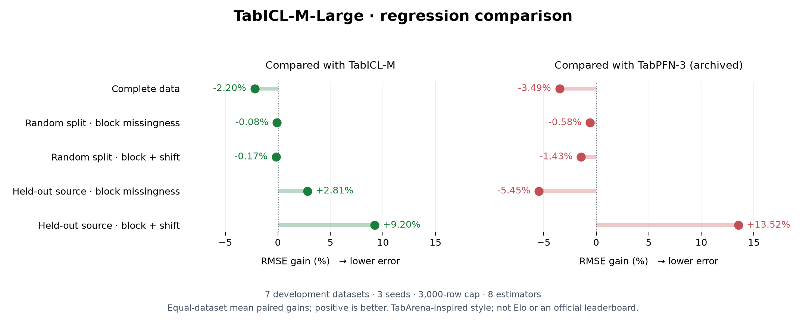

# TabICL-M / TabICL-M-Large

**TabICL-M is an ongoing research project exploring foundation models for
incomplete, multi-source tabular data.** Built on
[TabICLv2](https://github.com/soda-inria/tabicl), it studies how models can learn
from missingness patterns and differences between data sources, alongside a
separate effort to improve ordinary regression. **M means Missing.** Missingness
patterns are used as a proxy for source identity, not proof of a shared source.

The project is still in development. Early experiments show promise in specific
settings, but broader benchmarks, independent validation, and further model
development are needed.

**We are seeking research teams, academic groups, and individual collaborators**
to help strengthen this work. Contributions in model architecture, synthetic
data generation, large-scale training, rigorous evaluation, and real-world
multi-source datasets are especially welcome. To discuss collaboration, please
[open an issue](https://github.com/Sompote/TabICL-M/issues) describing your research
interests and how you would like to contribute.

## Models

| Model | Task | ICL blocks | Parameters | Status |
|---|---|---:|---:|---|
| **TabICL-M** | Classification and regression | 12 | 28.7M (regressor) | Original missing-aware checkpoints |
| **TabICL-M-Large** | Regression | 18 | 41.5M | Completed 20,000 additional training steps |
| **TabICL-Large** | Ordinary regression | 18 | 41.5M | 20k steps completed and evaluated; experimental |

TabICL-M and TabICL-M-Large use missing/source-aware training. In the Large recipe,
**70% of synthetic tables are selected for a missingness transform**, not 70% of
all cells. A separate [ordinary-regression continuation](docs/regression_large_ordinary_20k.md)
and a [residual encoder experiment](docs/regression_residual_input_experiment.md)
are complete. Neither justified replacing the existing checkpoints.
See [model variants and checkpoints](docs/model_variants.md).

## Quick start

From your cloned repository, with [Git LFS](https://git-lfs.com/) installed:

```bash
git lfs pull
pip install -e .
```

The distribution is `tabicl-m`; Python imports remain `tabicl`.

### Choose your weights

Set `model_path` to the checkpoint you want. Paths below are relative to the
repository root; an absolute path to your downloaded `.ckpt` also works.

| Model | Estimator | Checkpoint path |
|---|---|---|
| TabICL-M regression | `TabICLRegressor` | `checkpoints/tabicl-m-sa-20k/reg/step-10000.ckpt` |
| TabICL-M-Large regression | `TabICLRegressor` | `results/large_regression_20k/checkpoints/reg/step-20000.ckpt` |
| TabICL-Large regression (experimental) | `TabICLRegressor` | `results/large_ordinary_regression_20k/checkpoints/reg/step-20000.ckpt` |
| TabICL-M classification | `TabICLClassifier` | `checkpoints/tabicl-m-sa-20k/clf/step-10000.ckpt` |

**Availability:** `git lfs pull` retrieves the original weights. Large weights
are currently a local training artifact, not published in this repository;
you must obtain that checkpoint separately before selecting it. There are no
released ordinary-regression TabICL-Large weights yet.

```python
from tabicl import TabICLRegressor

# Switch this path to the Large regression checkpoint to use TabICL-M-Large.
weights = "checkpoints/tabicl-m-sa-20k/reg/step-10000.ckpt"
model = TabICLRegressor(model_path=weights)
model.fit(X_train, y_train)
predictions = model.predict(X_test)
```

For classification, use the classifier weights and estimator:

```python
from tabicl import TabICLClassifier

model = TabICLClassifier(
    model_path="checkpoints/tabicl-m-sa-20k/clf/step-10000.ckpt"
)
model.fit(X_train, y_train)
probabilities = model.predict_proba(X_test)
```

Keep missing values as `NaN`; pass a DataFrame for automatic categorical-column
detection. Select the checkpoint explicitly: omitting `model_path` uses upstream
weights. See the [model guide](docs/model_variants.md#checkpoints) for more details.

## Missing-aware Large benchmark



TabArena-inspired comparison layout using **RMSE gains**, not Elo or official
TabArena scores. Negative values mean Large has higher error.

RMSE change for **TabICL-M-Large**; positive means lower error:

| Evaluation condition | vs TabICL-M | vs TabPFN-3 |
|---|---:|---:|
| Complete data, random split | −2.20% | −3.49% |
| Held-out source, block missingness | +2.81% | −5.45% |
| Held-out source, block missingness + measurement shift | +9.20% | +13.52% |

Seven development datasets, three seeds, up to 3,000 rows, eight estimators.
Gains are averaged equally across datasets. TabPFN-3 scores are archived results
under matching recorded protocols, not a fresh rerun. Large improved most on
held-out sources with measurement shifts; it did **not** beat TabPFN-3 overall.
[Full evaluation and limitations](results/large_regression_20k_eval/report.md).

## Latest experiments — completed September 13, 2026

RMSE gains below are relative to each row's reference; **positive means lower error**.

| Experiment | Reference | Complete data | Held-out block | Held-out block + shift |
|---|---|---:|---:|---:|
| Ordinary regression, 20k steps | TabICL-M-Large | −0.37% | −9.89% | −12.98% |
| Residual input encoder, 2k steps | Unchanged model trained for the same 2k steps | +0.08% | −0.46% | +0.59% |

Ordinary training did not improve overall complete-data RMSE and reduced source
robustness. The encoder's gains fell below the agreed 1% complete-data threshold;
no further training or checkpoint promotion followed. These remain development
experiments on seven datasets and three evaluation seeds, with one training seed.

The ordinary complete-data comparison uses fresh CPU scores; its held-out comparisons
reuse previous GPU reference scores, so device/precision differences are a limitation.
Both encoder arms were evaluated freshly on GPU.
[Complete-data results](results/ordinary_regression_20k_eval/report.md) ·
[Held-out-source results](results/ordinary_regression_20k_heldout/report.md) ·
[Encoder results](results/residual_input_experiment/report.md).

## Documentation

- [Model variants, naming, and checkpoints](docs/model_variants.md)
- [Architecture](docs/tabicl_m_architecture.md)
- [Original training](docs/training.md) · [Large 20k training](docs/regression_large_20k.md)
- [Original benchmark tables](docs/results.md) · [Historical detailed write-up](docs/project_details.md)
- [Paper](paper/paper.pdf) · [Citation](docs/citation.md)

By Sompote Youwai, King Mongkut’s University of Technology Thonburi. Built on
TabICL by Jingang Qu, David Holzmüller, Gaël Varoquaux, and Marine Le Morvan.
[BSD 3-Clause License](LICENSE).
