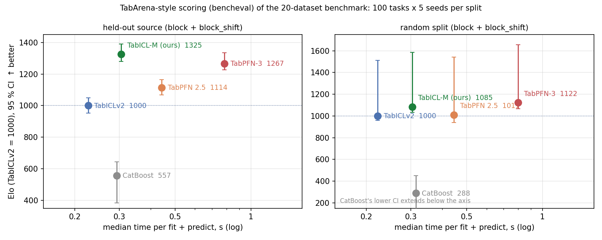
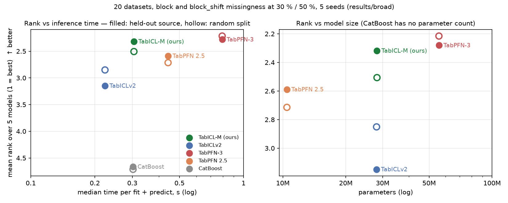

# TabICL-M: a tabular foundation model that reads missingness as provenance

TabICL-M (M for missingness) extends [TabICLv2](https://github.com/soda-inria/tabicl)
to tables that are merged from several sources, each of which measured its own subset
of the features on its own scale. That is the shape of most engineering databases: a
laboratory lacks whole columns rather than scattered cells, which columns a row lacks
tells you where it came from, and the same quantity measured in two laboratories
differs by an offset. TabICL-M is built on one observation: in such a table, rows that
share a missingness pattern come from the same source, so the pattern is free,
label-free provenance. It encodes every value relative to its own source, represents
every row from its observed features only, and carries a pattern token into
in-context learning. All additions start at zero, so on complete data the model is
TabICLv2 exactly.

This repository is a fork of TabICL by Qu, Holzmüller, Varoquaux and Le Morvan; all of
TabICLv2 is still here and works unchanged.

**Status.** Research code with released weights. On 20 public datasets with injected
block missingness, against TabICLv2, TabPFN 2.5, TabPFN-3 and CatBoost, TabICL-M is the
best model of any kind when a held-out source carries a measurement offset, level with
TabPFN-3 on classification, and behind TabPFN-3 only on plain regression, at half its
parameters and a third of its inference time. Details in
[Results at a glance](#results-at-a-glance) and [Findings in detail](#findings-in-detail).

**Paper.** [paper/paper.pdf](./paper/paper.pdf) (source `paper/paper.tex`): motivation,
the headroom study, the architecture and why these parts, training, the benchmark, the
ablations, the negative results.

**Weights** (git LFS, `git lfs pull`): use `checkpoints/tabicl-m-sa-20k/<task>/step-10000.ckpt`
(source-aware, 20k steps in total). Also shipped: `checkpoints/tabicl-m-sa/` (10k steps)
and `checkpoints/tabicl-m/` (first generation, value-level parts only, 3k steps).

## Quick start

```bash
git clone https://github.com/Sompote/TabICL-M.git && cd TabICL-M
git lfs pull                 # the checkpoints
pip install -e .             # installs as `tabicl`; do not install upstream tabicl in the same environment
```

```python
from tabicl import TabICLClassifier, TabICLRegressor

reg = TabICLRegressor(model_path="checkpoints/tabicl-m-sa-20k/reg/step-10000.ckpt")
reg.fit(X_train, y_train)            # X may contain NaN in any column; leave them as NaN, do not impute
pred = reg.predict(X_test)
q10, q90 = reg.predict(X_test, output_type="quantiles", alphas=[0.1, 0.9]).T

clf = TabICLClassifier(model_path="checkpoints/tabicl-m-sa-20k/clf/step-10000.ckpt")
clf.fit(X_train, y_train)
proba = clf.predict_proba(X_test)
print(clf.X_encoder_.impute)          # False: the model sees the gaps
```

Pass a DataFrame so categorical columns are detected. Rows from different sources with
different measured columns is the intended input; no source-id column is needed. With
the released TabICLv2 checkpoint (`TabICLClassifier()` with no path) the same estimators
mean-impute, exactly as upstream. KV caching, save and load, fine-tuning, forecasting
and SHAP work as in upstream TabICL ([Inherited features](#inherited-features)).

To evaluate on your own multi-source table, holding out one source at a time on its
natural gaps:

```bash
python scripts/ablation_missingness.py --out results/loso_mydata \
    --datasets csv:data/mytable.csv --target <target column> --source_col <source column> \
    --task regression --loso --natural \
    --models tabicl_impute tabicl_aware --aware_ckpt_reg checkpoints/tabicl-m-sa-20k/reg/step-10000.ckpt
```

## Results at a glance

Benchmark: 20 public datasets (13 classification, 7 regression), block and
block_shift missingness at 30 % and 50 %, 5 seeds, two splits. **Held-out source**: rows
are split into synthetic sources, each lacking its own subset of columns (block) and,
under block_shift, carrying its own additive offset and noise on the numeric features;
one whole source is the test set. **Random split**: every source is in the context.
About 400 conditions per split; everything reproducible from `results/broad`.

Mean rank over five models (1 = best); paired counts and datasets won are TabICL-M
against TabPFN-3 on identical splits and deleted cells.

Classification, 13 datasets:

| split | condition | **TabICL-M** | TabPFN-3 | TabPFN 2.5 | TabICLv2 | CatBoost | vs TabPFN-3 |
|---|---|---|---|---|---|---|---|
| held-out source | with offset | **2.35** | 2.41 | 2.48 | 3.08 | 4.68 | 61 / 69, **9 of 13 datasets** |
| held-out source | all | 2.36 | 2.36 | 2.58 | 3.01 | 4.69 | 123 / 133, 9 of 13 |
| held-out source | no offset | 2.37 | **2.31** | 2.68 | 2.94 | 4.70 | 62 / 64, 7 of 13 |
| random split | all | **2.35** | 2.45 | 2.69 | 2.77 | 4.74 | 131 / 120, 8 of 13 |

Regression, 7 datasets:

| split | condition | **TabICL-M** | TabPFN-3 | TabPFN 2.5 | TabICLv2 | CatBoost | vs TabPFN-3 |
|---|---|---|---|---|---|---|---|
| held-out source | with offset | **1.97** | 2.53 | 2.63 | 3.44 | 4.43 | **44 / 26, 5 of 7 datasets** |
| held-out source | all | 2.24 | **2.14** | 2.61 | 3.41 | 4.61 | 67 / 73, 3 of 7 |
| held-out source | no offset | 2.50 | **1.74** | 2.59 | 3.37 | 4.80 | 23 / 47, 2 of 7 |
| random split | all | 2.79 | **1.79** | 2.75 | 3.00 | 4.67 | 42 / 98, 1 of 7 |

**Scored the TabArena way.** The same runs scored with TabArena's evaluator (`bencheval`:
Elo with 95 % bootstrap CI, rank, win rate, improvability), each (dataset, mechanism, rate)
a task and each seed a repeat, log loss / RMSE as the error, Elo anchored to TabICLv2 = 1000
(`scripts/plots/tabarena_style_scores.py`, `results/tabarena_style/`):



Held-out source:

| model | Elo | 95 % CI | rank | win rate | improvability (%) | MRR | median s / fit |
|---|---|---|---|---|---|---|---|
| TabICL-M (ours) | 1325 | +65 / −45 | 1.79 | 0.80 | 2.5 | 0.70 | 0.31 |
| TabPFN-3 | 1267 | +68 / −40 | 2.07 | 0.73 | 3.0 | 0.61 | 0.79 |
| TabPFN 2.5 | 1114 | +51 / −46 | 2.86 | 0.54 | 8.3 | 0.41 | 0.44 |
| TabICLv2 | 1000 | +50 / −47 | 3.42 | 0.40 | 11.8 | 0.35 | 0.23 |
| CatBoost | 557 | +87 / −175 | 4.86 | 0.04 | 28.8 | 0.21 | 0.29 |

Random split:

| model | Elo | 95 % CI | rank | win rate | improvability (%) | MRR | median s / fit |
|---|---|---|---|---|---|---|---|
| TabPFN-3 | 1122 | +533 / −54 | 2.13 | 0.72 | 1.9 | 0.64 | 0.80 |
| TabICL-M (ours) | 1085 | +500 / −50 | 2.34 | 0.67 | 1.7 | 0.55 | 0.30 |
| TabPFN 2.5 | 1011 | +533 / −70 | 2.76 | 0.56 | 2.8 | 0.44 | 0.44 |
| TabICLv2 | 1000 | +512 / −42 | 2.82 | 0.55 | 2.1 | 0.45 | 0.22 |
| CatBoost | 288 | +162 / −2005 | 4.95 | 0.01 | 15.6 | 0.21 | 0.31 |

**Accuracy against cost** (`scripts/plots/rank_vs_time_params.py`):



| model | parameters | median s / fit | mean rank, held-out source | mean rank, random split | mean AUC, held-out source (13 clf datasets) |
|---|---|---|---|---|---|
| TabICL-M (ours) | 28.2 M | 0.3 | 2.32 | 2.51 | 0.828 |
| TabPFN-3 | 55.7 M | 0.8 | 2.28 | 2.22 | 0.826 |
| TabPFN 2.5 | 10.5 M | 0.4 | 2.59 | 2.71 | 0.826 |
| TabICLv2 | 28.0 M | 0.2 | 3.15 | 2.85 | 0.820 |
| CatBoost | — | 0.3 | 4.66 | 4.71 | 0.770 |

**Reading.** On classification TabICL-M is level with TabPFN-3 everywhere (differences of
0.002–0.005 AUC, inside seed noise). On regression it is clearly ahead when a held-out
source carries an offset (2.1 % lower RMSE, 44 / 26) and clearly behind without one; that
gap was probed exhaustively and is the base regressor's, not the method's
([Findings in detail](#findings-in-detail)). Against TabICLv2, its own base, TabICL-M
lowers regression RMSE by 8.5 % on held-out sources with offset (59 / 11, 7 of 7 datasets)
and is within 0.7 % on complete data; against TabPFN 2.5 and CatBoost it wins every
summary. It does this with 28 M parameters and 0.3 s per fit against 56 M and 0.8 s for
TabPFN-3. In one line: level with TabPFN-3 on classification, the best model of any kind
when a new source arrives with its own calibration, behind TabPFN-3 only on plain
regression.

## How it works


TabICLv2 embeds each column with a set transformer (stage 1), runs a transformer over the
tokens of each row (stage 2) and learns in context over rows (stage 3). TabICL-M keeps all
three and adds, each behind a flag so that it can be ablated:

| stage | addition | flag |
|---|---|---|
| 1, column embedder | missing cells are zero-filled, hidden from the inducing-point attention so that column statistics come from observed cells only, flagged by a projected indicator, and given a learned absence vector | `col_missing_aware` |
| 1, column embedder | **source-relative values**: every observed cell is also fed standardised within the rows that share its missingness pattern (labelled and unlabelled rows pooled, no labels used), through a zero-initialised projection | `col_group_stats` |
| 2, row interaction | **observed-only rows**: feature tokens whose cells are all missing are excluded from the attention keys, so a row is represented from what it has | `row_missing_aware` |
| 2, row interaction | **pattern token**: a learned query reads out which features a row lacks and adds it, through a zero-initialised projection, to the row representation | `pattern_token` |
| training | **block reconstruction**: a pseudo-source loses a block of columns and the model reconstructs them from the row-stage tokens (head dropped at inference); **offset consistency**: a view with per-source offset and noise must give the same predictions as the clean view | `--recon_mode`, `--consistency_weight` |

Every new parameter starts at zero, so a run starts exactly at the released TabICLv2 and
the tests (`tests/test_source_aware.py`, `tests/test_missing_aware_embedding.py`) check
that complete data gives the same output to 1e-6. The full description with every revised
file is in [docs/tabicl_m_architecture.md](./docs/tabicl_m_architecture.md).


**The prior.** TabICL-M trains on synthetic tables only, from TabICLv2's structural causal
model prior, with a missingness transform applied to every table: rows are split into 2 to
8 sources, each observing 20 to 100 % of the features with an optional core set seen by
all; numeric features receive a per-source offset (up to 1.2 σ) and noise; with high
probability the sources occupy contiguous row blocks so that one falls entirely in the test
part, the held-out-source case; cell-wise MCAR, MAR and MNAR gaps, including
detection-limit censoring, are layered on top. The target is never masked. Code:
`src/tabicl/prior/_missingness.py`.

**What is not new.** [TabPFN v2](https://www.nature.com/articles/s41586-024-08328-6)
injects cell-wise missingness into its prior and adds a missing indicator;
[NAIM](https://arxiv.org/abs/2407.11540) masks missing features out of attention;
[ReMasker](https://arxiv.org/abs/2309.13793) and [VIME](https://arxiv.org/abs/2006.06731)
train with masked-cell reconstruction. All treat missingness as cell-wise and random. The
contribution here is reading the pattern as the source, and the three parts that use it,
inside an in-context learner.

## Training

Continued pre-training from the released TabICLv2 weights, one GPU with 32 GB
(`DTYPE=bfloat16` is required without FlashAttention-3):

```bash
pip install -e ".[pretrain]"
python -c "from tabicl import TabICLClassifier, TabICLRegressor; TabICLClassifier()._load_model(); TabICLRegressor()._load_model()"
ARCH=source_aware bash scripts/train_v2_missing_stage4.sh clf     # and: reg
```

The shipped checkpoints took two stages of 10 000 steps each per task (stage 4 at
lr 5e-5, stage 4b at 3e-5 on stronger source offsets), about 9.5 hours per stage and task
on an RTX 5090. Each part has an environment switch (`COL_GROUP_STATS`, `ROW_MISSING_AWARE`,
`PATTERN_TOKEN`, `RECON_MODE`, `CONSISTENCY_WEIGHT`) and the regression head is selectable
(`HEAD=quantile|bar`). Recipes, loss trajectories, the ablation recipe, the self-driving
pipelines, hardware and timing: [docs/training.md](./docs/training.md). All `--missing_*`
options: `python -m tabicl.train --help`.

## Evaluation

`scripts/ablation_missingness.py` deletes cells from complete tables under a stated
mechanism (`mcar`, `mar`, `mnar`, `block`, `block_shift`) at a stated rate, optionally
holds out a whole synthetic source (`--split source`), and compares:

| model name | what it is |
|---|---|
| `tabicl_impute` | released TabICLv2, NaN mean-imputed (the base) |
| `tabicl_indicator`, `tabicl_iterimpute`, `tabicl_knnimpute`, `tabicl_patternnorm` | the base behind an indicator column, IterativeImputer, KNNImputer, or pattern-conditional normalisation |
| `tabicl_aware_zero` | released weights inside the TabICL-M architecture, new parameters at zero |
| `tabicl_aware` | a TabICL-M checkpoint (`--aware_ckpt`, `--aware_ckpt_reg`); suffixes `_n32`, `_med`, `_ypow`, `_qn`, `_ewt`, `_si` for test-time variants |
| `tabpfn`, `tabpfn25`, `tabpfn26`, `tabpfn3` | TabPFN v2 (tabicl==2.2.1 public weights) and the 2.5 / 2.6 / 3 default checkpoints (tabpfn>=8) |
| `xgboost`, `catboost` | trees with native NaN handling |

Metrics: AUC, accuracy, log loss; RMSE, R², coverage and width of the 80 % interval.
Outputs: `results.csv` (one row per fit), `summary.csv`, `summary.md`, plots. A CSV with
a source column runs leave-one-source-out on its natural gaps (`--loso --natural`).
`scripts/tabarena/run_tabarena.py` runs TabICL-M inside the TabArena framework
(TabArena-Lite, BeyondArena) against their cached leaderboards.

## Findings in detail

All tables are in [docs/results.md](./docs/results.md); the directories named below hold
the raw results.

**Where the headroom is** (`results/headroom/`). The first-generation checkpoint
(value-level parts only) tied mean imputation within seed noise, which located the
headroom: not under random gaps, where mean imputation inside an in-context learner is
near the information limit and no model is separable from any other, but under a
held-out source with an offset, where TabICLv2 loses a further 0.02–0.08 AUC or 1–3 RMSE
(adult 0.847 → 0.800, Boston 5.84 → 7.08) and every alternative loses more: iterative
imputation worse than mean imputation on all six datasets, trees far worse, TabPFN v2,
2.5 and 3 in the same band as TabICLv2.

**Ablation** (`results/sa_ablation/`, `results/sa_ablation_reg/`; one switch off at a
time, 3 000 steps each, held-out source with offset):

| variant | classifier win rate vs mean imputation | regressor RMSE gain vs TabICLv2 |
|---|---|---|
| all parts on | 0.73 | +5.1 % |
| without source-relative values | 0.70 | +4.9 % |
| without observed-only rows | 0.68 | +4.8 % |
| without pattern token | 0.65 | +5.3 % |
| without the two objectives | 0.70 | +5.1 % |
| all parts off (new prior only) | 0.62 | +4.5 % |
| all parts on, full training (10k / 20k) | 0.77 | +8.6 % |

Every part helps the classifier, the pattern token and observed-only rows most, and the
prior alone adds nothing; for the regressor the prior alone already helps, the parts add
about one point, and training length adds the rest. No part hurts either task on
complete data.

**Regression against TabPFN-3** (`results/regression/`). Ahead when the held-out source
has an offset (49 / 21, 4 of 7 datasets, 2.1 % lower RMSE), behind without one and on
random splits. Everything tried to close that gap failed and is documented: 32 ensemble
members, median, target power transform, an extra normalisation member, a weight soup of
the 10k and 20k regressors (+0.08 %), continued training on a half-complete prior (85 / 90
after 3 500 steps), test-time fine-tuning on the context rows (recovers a third of the
kin8nm gap, then plateaus; TabPFN-3 fine-tuned the same way gets worse), and a TabPFN-style
histogram head trained for 20k steps (worse than the quantile head on every dataset, 9 / 26).
The kin8nm gap exists at every training-set size and TabPFN 2.5 with 10 M parameters shows
it too, so it is neither sample efficiency nor capacity: it is base-regressor quality on
smooth functions, inherited from TabICLv2 (its released regressor ranks 6.4 against
TabPFN-3's 4.0 there).

**Calibration.** Under a held-out source the TabICL-M regressor's 80 % interval covers
0.81 at a width of 1.6 target standard deviations; TabICLv2 over-covers at 0.87 with width
2.1. TabPFN's intervals were not recorded.

**Two more negative results** (`results/sa_eval/tt/`): letting test rows attend in the
column set transformer is a coin flip (46 / 66), and self-imputation with the
reconstruction head before predicting hurts (29 / 83). Both are implemented
(`embed_with_test`, `self_impute`) and off by default.

## What remains

1. **Real multi-source data.** All source structure so far is synthetic, imposed on
   complete tables. The compaction database with its laboratory groups, held out one
   laboratory at a time, is the intended test and has not been run.
2. **Plain regression.** TabPFN-3 leads wherever no source offset is involved; the gap is
   base-regressor quality, and closing it needs a stronger base regressor, not more
   missingness training.
3. **Significance.** Five seeds give paired win rates of 52–57 % against TabPFN-3 under
   offset: a rank difference, not yet a significant per-dataset margin.
4. **Public leaderboards.** TabArena's and BeyondArena's datasets are complete, so they
   cannot show the effect targeted here. A TabArena-Lite run and a BeyondArena
   grouped-split run through their framework are in progress (`scripts/tabarena/`).
5. **Intervals.** TabPFN's quantiles were not recorded; the interval comparison is open.

## Repository map

```
src/tabicl/_model/embedding.py        missing-aware column embedding, source-relative values (col_missing_aware, col_group_stats)
src/tabicl/_model/interaction.py      observed-only rows, pattern token, per-feature token outputs (row_missing_aware, pattern_token)
src/tabicl/_model/tabicl.py           flags, reconstruction head and loss, bar head, tolerant checkpoint loading
src/tabicl/_model/bar_dist.py         histogram regression head (negative result, kept selectable)
src/tabicl/prior/_missingness.py      block-structured and cell-wise missingness for prior tables
src/tabicl/train/_reconstruction.py   cell and block hide-mask sampling
src/tabicl/train/_consistency.py      offset-consistency objective
src/tabicl/train/_run.py              joint loss, manual gradient averaging
src/tabicl/_sklearn/                  NaN pass-through when the model is missing-aware
scripts/train_v2_missing_stage4.sh    continued pre-training recipe (ARCH=source_aware, per-part switches, HEAD)
scripts/ablation_missingness.py       evaluation runner
scripts/tabarena/                     TabICL-M inside the TabArena framework
scripts/plots/                        rank-vs-time/parameters and TabArena-style Elo figures
checkpoints/tabicl-m-sa-20k/          the weights to use (git LFS)
checkpoints/tabicl-m-sa/, tabicl-m/   10k-step and first-generation weights; launchers and pipelines
results/broad/                        the 20-dataset benchmark
results/tabarena_style/               TabArena-style scoring of it
results/headroom/                     where the headroom is
results/sa_ablation/, sa_ablation_reg/ per-part ablations
results/regression/                   regression against TabPFN-3, every lever tried
results/sa_eval/, sa_eval_20k/, ablation_m/, ablation_v2/   evaluations of each checkpoint generation
paper/                                paper.tex, paper.pdf
docs/                                 tabicl_m_architecture.md, training.md, results.md, figures/
tests/                                90 tests; the TabICL-M files need no checkpoint and run on CPU in seconds
```

Run the tests with `pytest tests/`. On macOS, XGBoost and torch load two different OpenMP
runtimes and can deadlock in one process; the runner fits tree baselines in a spawned
child for that reason.

## Inherited features

Everything below comes from upstream TabICLv2 and is unchanged.

**KV cache and persistence.** `TabICLClassifier(kv_cache=True)` caches the
training context during `fit` for fast repeated `predict`. `clf.save(path)` and
`TabICLClassifier.load(path)` persist a fitted estimator, optionally without the
training data when a cache exists.

**Parameters.** `n_estimators=8`, `norm_methods`, `feat_shuffle_method="latin"`,
`class_shuffle_method="shift"`, `outlier_threshold=4.0`,
`softmax_temperature=0.9`, `average_logits=True`, `support_many_classes=True`,
`batch_size=8`, `model_path`, `checkpoint_version`, `device`, `use_amp="auto"`,
`use_fa3="auto"`, `offload_mode="auto"`, `random_state=42`, `n_jobs`,
`inference_config`. See the class docstrings.

**Available upstream checkpoints.** `tabicl-classifier-v2-20260212.ckpt` and
`tabicl-regressor-v2-20260212.ckpt` (default), plus the v1 and v1.1 classifiers.
They download from Hugging Face on first use.

**Fine-tuning.** `FinetunedTabICLClassifier` and `FinetunedTabICLRegressor`
adapt a checkpoint to one dataset with AdamW, early stopping, and multi-GPU under
`torchrun`. See `tutorials/finetune_classifier.py`.

**Time series.** `TabICLForecaster` does zero-shot forecasting through the
regressor. See `tutorials/time_series_forecasting.py`.

**Explainability.** `tabicl.shap` computes SHAP values using an all-NaN background
row. With the released checkpoints the all-NaN columns are handled by the wrapper.

**Pre-training from scratch.** The three-stage TabICLv2 recipes are in
`scripts/train_v2_{clf,reg}_stage{1,2,3}.sh`. Prior tables can be generated on the
fly or written to disk with `python -m tabicl.prior`.

**Preprocessing.** Categorical columns are ordinal-encoded, outliers clipped,
features scaled and normalised, and features shuffled across ensemble members.
For heterogeneous raw data, [skrub](https://skrub-data.org) `TableVectorizer` in a
scikit-learn pipeline works well in front of the estimators.

## Citation

```bibtex
@misc{youwai2026tabiclm,
  title={{TabICL-M}: A Tabular Foundation Model that Reads Missingness as Provenance},
  author={Youwai, Sompote},
  year={2026},
  howpublished={\url{https://github.com/Sompote/TabICL-M}}
}

@inproceedings{qu2025tabicl,
  title={Tab{ICL}: {A} Tabular Foundation Model for In-Context Learning on Large Data},
  author={Qu, Jingang and Holzm{\"u}ller, David and Varoquaux, Ga{\"e}l and Le Morvan, Marine},
  booktitle={International Conference on Machine Learning},
  year={2025}
}

@article{qu2026tabiclv2,
  title={{TabICLv2}: {A} better, faster, scalable, and open tabular foundation model},
  author={Qu, Jingang and Holzm{\"u}ller, David and Varoquaux, Ga{\"e}l and Le Morvan, Marine},
  journal={arXiv:2602.11139},
  year={2026}
}
```

## Authors and license

TabICL-M: Sompote Youwai, King Mongkut's University of Technology Thonburi.

Upstream TabICL: Jingang Qu, David Holzmüller, Marine Le Morvan and Gaël Varoquaux
(Inria Soda). Both are released under the BSD 3-Clause License, see `LICENSE`.
